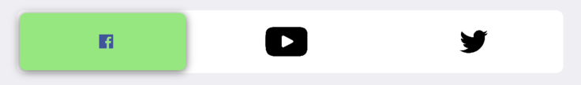

# TTSegmentedControl


[](https://cocoapods.org/pods/TTSegmentedControl)
[](https://cocoapods.org/pods/TTSegmentedControl)
[](http://cocoapods.org/pods/TTSegmentedControl)
[](http://twitter.com/Tapptitude)

## About
An elegant, animated and customizable segmented control for iOS.

This project is maintained by Tapptitude, a mobile app development agency specialized in building high-quality iOS and Android mobile apps, for startups and brands alike. A lively team of skilled app developers and app designers based in Europe, we provide full-stack mobile app development services to entrepreneurs looking to innovate on mobile. 


## Features:
- Variable number of items 
- Animated transition
- Bounce animation
- Fully configurable (color, gradient, shadow, corner radius)
- Designable into Interface Builder

## Requirements

- iOS 8.0+
- Xcode 7.3+

## Installation

_CocoaPods_

_Swift 5.0_

```ruby
pod 'TTSegmentedControl', '~>0.4.9'
```
_Swift 4.2_

```ruby
pod 'TTSegmentedControl', '~>0.4.8'
```

_Swift 4.0_

```ruby
pod 'TTSegmentedControl', '~>0.4.6'
```

_Swift 3.X_

```ruby
pod 'TTSegmentedControl', '~>0.3'
```

_Swift 2.x_
```ruby
pod 'TTSegmentedControl', '0.1.1'
```

_Carthage_

```
github "tapptitude/TTSegmentedControl"
```

_Manually_

Add the TTSegmentedControl.swift file to your project.

## Usage

- Programatic:


```
let segmentedControl = TTSegmentedControl()
segmentedControl.allowChangeThumbWidth = false
segmentedControl.frame = CGRect(x: 50, y: 200, width: 100, height: 50)
segmentedControl.didSelectItemWith = { (index, title) -> () in
    print("Selected item \(index)")
}
view.addSubview(segmentedControl)
```

- Interface Builder:

Add a UIView and set it's class to TTSegmentedControl. You can customize the control directly from the interface builder.


## How to customize?

Checkout the playground and see how to implement and customize the SegmentedControl.

```ruby
pod try TTSegmentedControl
```

In order to customize the segmented control you'll have to edit it's properties.

```swift
segmentedControl.defaultTextColor = UIColor.blackColor()
segmentedControl.selectedTextColor = UIColor.whiteColor()
segmentedControl.thumbGradientColors = [UIColor.redColor(), UIColor.blueColor()]
segmentedControl.useShadow = true

```

You can add image instead of title.



```swift
// ask segmented control to initialize all elements internally
segmentedControl.layoutSubviews()
        
let imageAttachment = NSTextAttachment()
imageAttachment.image = image
imageAttachment.bounds = CGRect(x: 0, y: -5, width: 20, height: 20)
        
let attributes = NSAttributedString(attachment: imageAttachment)
        
segmentedControl.changeAttributedTitle(attributes, selectedTile: attributes, atIndex: atIndex)
```

Or combine them.

```swift
// ask segmented control to initialize all elements internally
segmentedControl.layoutSubviews()
        
let imageAttachment = NSTextAttachment()
imageAttachment.image = image
imageAttachment.bounds = CGRect(x: 0, y: -5, width: 20, height: 20)
        
let attributes = segmentedControl.attributedDefaultTitles.first?.mutableCopy() as! NSMutableAttributedString
attributes.append(NSAttributedString(attachment: imageAttachment))
        
let selectedAttributes = segmentedControl.attributedSelectedTitles.first?.mutableCopy() as! NSMutableAttributedString
selectedAttributes.append(NSAttributedString(attachment: imageAttachment))
        
segmentedControl.changeAttributedTitle(attributes, selectedTile: selectedAttributes, atIndex: atIndex)
```
## Contribution

Feel free to Fork, submit Pull Requests or send us your feedback and suggestions!


## License

TTSegmentedControl is available under the MIT license. See the LICENSE file for more info.
