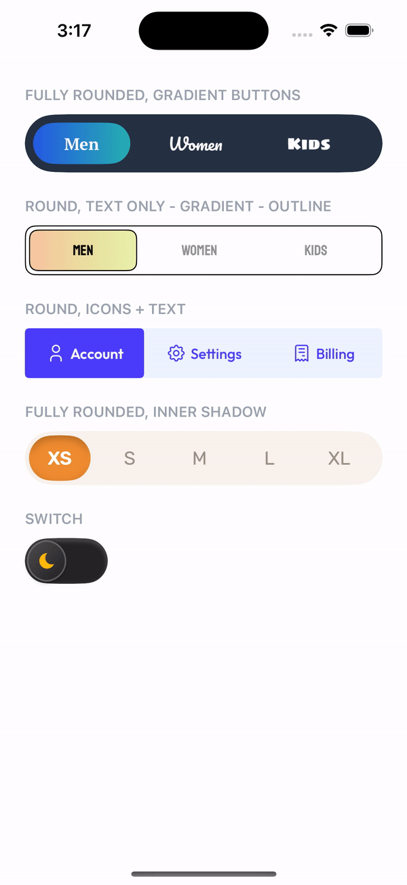
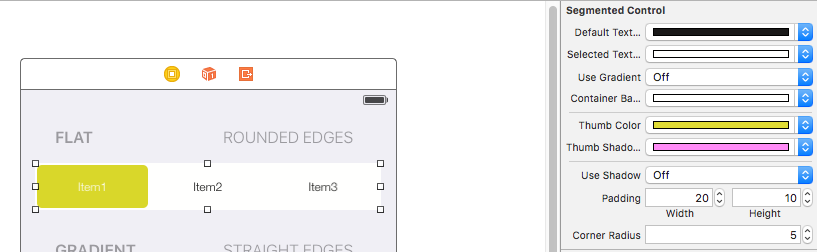

# TTSegmentedControl

[](https://cocoapods.org/pods/TTSegmentedControl)
[](https://cocoapods.org/pods/TTSegmentedControl)
[](http://cocoapods.org/pods/TTSegmentedControl)
[](http://twitter.com/Tapptitude)

## About
An elegant, animated and customizable segmented control for iOS.

This project is maintained by Tapptitude, a Product-Focused Mobile Development Agency based in Cluj-Napoca, Romania, and London, the UK, specialised in building high-quality Native Mobile Apps on iOS & Android. 




## Features:
- Variable number of items 
- Animated transition
- Fully configurable (color, gradient, shadow, corner radius)
- Designable into Interface Builder

## Requirements

- iOS 8.0+
- Xcode 7.3+

## Installation

_CocoaPods_

_Swift 4.0_

```ruby
pod 'TTSegmentedControl'
```

_Swift 3.X_

```ruby
pod 'TTSegmentedControl', '~>0.3'
```

_Swift 2.x_
```ruby
pod 'TTSegmentedControl', '0.1.1'
```

_Carthage_

```
github "tapptitude/TTSegmentedControl"
```

_Manually_

Add the TTSegmentedControl.swift file to your project.

## Usage

- Programatic:


```
let segmentedControl = TTSegmentedControl()
segmentedControl.allowChangeThumbWidth = false
segmentedControl.frame = CGRect(x: 50, y: 200, width: 100, height: 50)
segmentedControl.didSelectItemWith = { (index, title) -> () in
    print("Selected item \(index)")
}
view.addSubview(segmentedControl)
```

- Interface Builder:

Add a UIView and set it's class to TTSegmentedControl. You can customize the control directly from the interface builder.




## How to customize?

Checkout the playground and see how to implement and customize the SegmentedControl.

```ruby
pod try TTSegmentedControl
```

In order to customize the segmented control you'll have to edit it's properties.

```swift
segmentedControl.defaultTextColor = UIColor.blackColor()
segmentedControl.selectedTextColor = UIColor.whiteColor()
segmentedControl.thumbGradientColors = [UIColor.redColor(), UIColor.blueColor()]
segmentedControl.useShadow = true

```


## Contribution

Feel free to Fork, submit Pull Requests or send us your feedback and suggestions!


## License

TTSegmentedControl is available under the MIT license. See the LICENSE file for more info.
